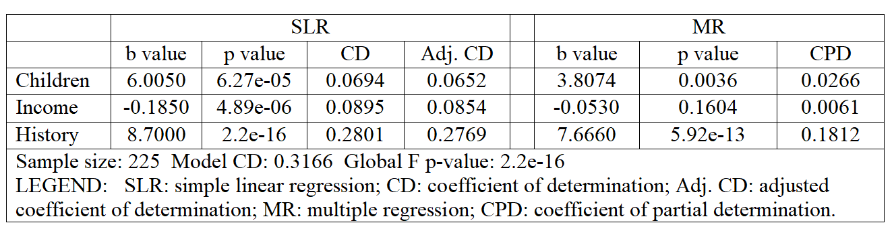

# FlixIt Streaming Analysis
FlixIt Inc. aims to understand the factors influencing streaming behavior among its subscribers to improve customer retention and enhance engagement with premium services. This analysis predicts **streaming hours** based on three key predictors: annual **Income**, number of **Children** under 18 in the household, and subscription **History** (years as a FlixIt subscriber). The primary objective is to determine the individual and combined effects of these factors on streaming behavior, guiding strategic decisions for customer segmentation and retention.

## Basic Information
**Names:** N M Emran Hussain  
**Email:** nmemranhussain2023@gmail.com  
**Date:** October 2024  
**License:** [MIT License](LICENSE)

## Intended Use
**Purpose:**  
- Predict streaming hours based on **Income** only
- Predict streaming hours based on **Number of Children** only
- Predict streaming hours based on **Subscription History** only
- Combined model to predict streaming hours using **Income**, **Number of Children** and **Subscription History** altogether
- Assess the **unconditional (bivarite)** and the **conditional (multivariate)** relationship between the **independent predictors** and the **dependable variables** and to identify the most influential predictors to refine the model for optimal performance.
- All results are reported with a minimum precision of four decimal places, using an alpha level of 0.05 for statistical tests. (95% confidence level)

**Intended Users:**
- Data Analysts, Data scientists, machine learning enthusiasts, educators.

**Out-of-scope Uses:**
- The model is not intended for production use in any critical applications or real-time decision-making systems.

## Training Data 
- **Dataset File**: `FlixIt.dat`
- **Number of Rows**: 225
- **File Format**: `.dat` (space-separated values).

### Data Dictionary

| **Variable Name**     | **Model Role** | **Measurement Level** | **Description**                                                             |
|-----------------------|----------------|-----------------------|-----------------------------------------------------------------------------|
| Customer ID           | Identifier     | Nominal               | Unique identifier for each customer.                                        |
| Streaming_hours       | Dependent      | Ratio                 | Number of hours spent streaming content (target variable).                  |
| Number_of_children    | Independent    | Ratio                 | Number of children in the household.                                        |
| Income                | Independent    | Ratio                 | Monthly income of the customer (in thousands).                              |
| History               | Independent    | Ordinal               | Customer's historical engagement level (e.g., ratings from 1 to 5).         |

## Model Details
### Architecture  
- This model card utilizes linear model such as **'Multiple Regression'**. To understand inght, an alternative model **'Simple Linear Regression'** model is also used.   

### Evaluation Metrics  
- **Coefficient of multiple determination (R²)** - Indicates the strength of relationships in **'sample'**. It is also denoted by CD.
- **Adjusted R²** - Indicates the strength of relationships in **'population'**. It is also denoted by Adjusted CD.
- **Coefficient of partial determination (CPD)** - Indicates what portion of each independent variables can explain the 'Streaming Hours'.
- **Unconditional P-value** - Indicates statistical significance in bivariate level (simple regression) using 95% confidence level.
- **Conditional P-value** - Indicates statistical significance in multivariate level (multiple regression) using 95% confidence level.
- **b-value in SLR** - represents the magnitude and direction of **'slope'** of independent variable in a simple regression model.
- **b-value in MLR** - represents the magnitude and direction of **'slope'** of independent variables in a multiple regression model.
- **Global F P-value** - indicates at least one of the predictor variables is statistical-significantly related with dependent variable in 95% confidence level.

### Columns Used as Inputs in the Final Model
The following columns were used as inputs (features) in the final model:
- **Children**: Number of children in the household
- **Income**: Annual income in thousands
- **History**: Number of years subscribed to FlixIt

### Column(s) Used as Target(s) in the Final Model
- **Target Column:** **Hours** (Total streaming hours in the past 30 days)

### Type of Models
* **Simple Regression Classifier**
* **Multiple Regression Classifier**

### Software Used to Implement the Model
- **Software:** R (with libraries such as **deplyr**, **heplots**)

### Version of the Modeling Software: 
- **R:** 4.3.2
- **deplyr:** 1.1.4
- **heplots:**: 1.7.0

## Quantitative Analysis

### Simple (SLR) and Multiple (MR) Regression Analysis table

   
- **Children**: Has a positive impact on streaming hours, suggesting family-friendly marketing initiatives could increase engagement.
- **Income**: Minimal influence, indicating limited segmentation value based on income.
- **History**: Strong positive relationship, implying long-term subscribers are more engaged.

### Interpretation
- **An interpretation of the SLR b-value associated with Income**: This b-value represents the slope of the regression line when predicting the dependent variable based solely on Income. It means for each one-unit increase in ‘Income’, there is an expected decrease of 0.1850 units in ‘Hours’, holding other variables constant. 
- **An interpretation of the SLR CD value associated with Income**: The SLR CD value associated with ‘Income’ indicates that only 8.95% of the variation in the 'Hours’ can be explained by ‘Income’ alone in a ‘sample’ of simple linear regression model. Thus, we can conclude that the strength of relationship between ‘Hours’ and ‘Income’ is ‘low’ in the sample.
- **An interpretation of the SLR Adj. CD value associated with Income**: The SLR Adj. CD value associated with ‘Income’ indicates that only 8.54% of the variation in the 'Hours’ can be explained by ‘Income’ alone in a ‘population’ of simple linear regression model. Thus, we can conclude that the strength of relationship between ‘Hours’ and ‘Income’ is  'low’ in population.
- **An interpretation of the MR CPD value associated with Income**: This CPD (Coefficient of Partial Determination) value indicates that, when controlling for the other variables (‘Children’ and ‘History’), Income only uniquely explains approximately 0.61% of the variation in the 'Hours’. 
- **An interpretation of the MR Coefficient of Multiple Determination**: Here, MR Coefficient of Multiple Determination is the Model CD is 0.3166, meaning that approximately 31.66% of the variation in the 'Hours’ is explained by the combined influence of the predictors (Children, Income & History) in the ‘sample’ by the multiple regression model. It means the strength of the relationship among ‘Hours’ and ‘Children’, ‘Income’ & ‘History’ is moderate in sample. 
- **An interpretation of the MR Adjusted Coefficient of Multiple Determination**: The MR Adjusted Coefficient of Multiple Determination 0.3073, that approximately 30.73% of the variation in the 'Hours’ is explained by the combined influence of the predictors (Children, Income & History) in the ‘population’ by the multiple regression model. It means the strength of the relationship among ‘Hours’ and ‘Children’, ‘Income’ & ‘History’ is moderate in population.
- **An interpretation of the Global F p-value**: Global F p-value 2.2e-16 which is less than 0.05. It means that we can reasonably conclude that at least one of the predictor variables (either ‘Children’ or ‘Income’ or ‘History’) is statistical-significantly related with ‘Hours’ in 95% confidence level. 

## Recommandation
We should prioritize strategies targeting customers with a strong ‘subcription history’ with the company, as this variable has the most significant positive impact on the outcome. Additionally, customers with children also show a positive association, suggesting potential for family-oriented marketing efforts. Income, however, appears to have minimal influence on the outcome, especially in the multiple regression model, and can be deprioritized in customer segmentation efforts. While the model explains about 31.66% of the variance in the outcome, there remains a substantial portion unexplained, indicating that we could benefit from exploring additional variables to enhance the model's explanatory power and better capture other influential factors. 

## Potential Impacts, Risks, and Uncertainties
Simple regression models offer an accessible and interpretable way to analyze the relationship between a dependent variable and a single independent variable. This simplicity ensures clarity in the outcomes, making it easier for stakeholders to understand and utilize the findings for decision-making. However, the reliance on one predictor can oversimplify complex systems, potentially overlooking critical influencing factors and interactions. This limitation introduces a risk of biased conclusions, particularly when the omitted variables significantly affect the dependent variable. Ensuring robust data preprocessing and validation techniques helps mitigate these risks but does not eliminate the inherent uncertainties of using a singular dimension in predictive modeling.

On the other hand, multiple regression models extend the analytical power by incorporating multiple independent variables to explain or predict a dependent variable. This approach better captures complex relationships and interactions, enhancing prediction accuracy and decision-making insights. However, these models carry risks such as multicollinearity, overfitting, and sensitivity to outliers, which can undermine the reliability of the results. Addressing these risks requires careful feature selection, regularization techniques, and thorough model validation. Moreover, uncertainties arise from potential data biases and limitations in capturing the true relationships between variables. While the model's complexity offers better explanatory power, its interpretability can be challenging without tools to make predictions transparent and accountable.

